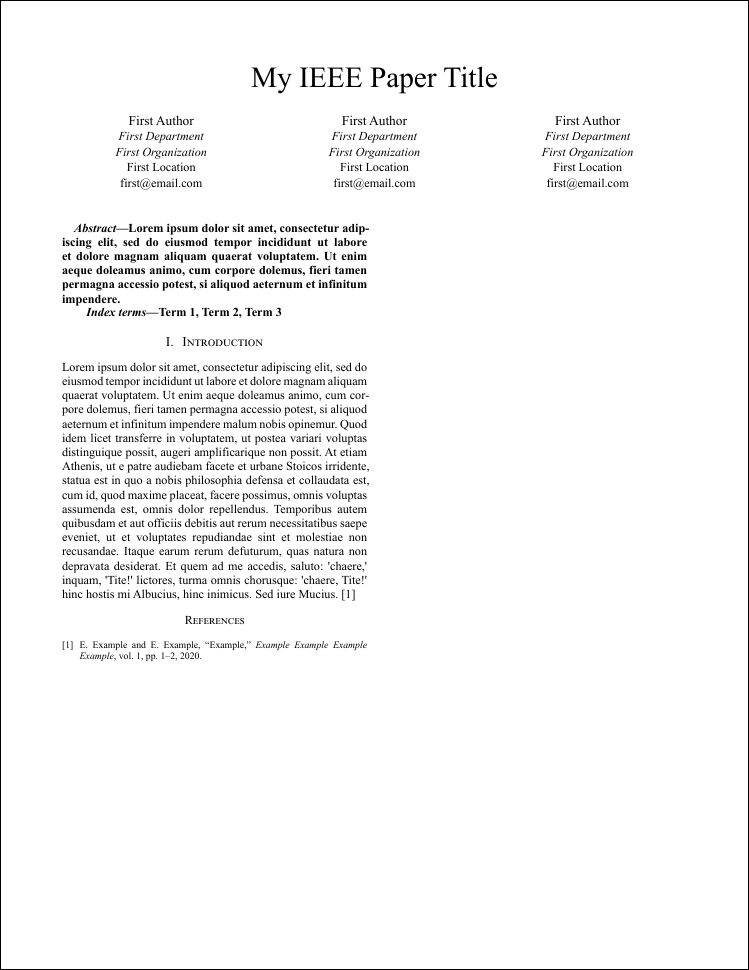

# ⚡ Typst IEEE ⚡

This is my personal IEEE paper template written in [Typst](https://typst.com), made by refactoring other publicly accessible templates to make it more modular.

**Table of Contents**

- [⚡ Typst IEEE ⚡](#-typst-ieee-)
- [🤔 How to Use](#-how-to-use)
- [🏃 How to Run](#-how-to-run)
- [🗒️ Acknowledgments](#️-acknowledgments)

## 🤔 How to Use

0. Download typst (and preferably the Tinymist Typst extension in VSCode)

1. Replace the predefined constants in the [main.typ](main.typ) file

2. Add a new section by creating a new file in the [src](src/) directory, then include it in the [main.typ](main.typ) file

## 🏃 How to Run

- To watch the current project, use the `make watch` command

- To compile the current project, use the `make compile` command

## 🗒️ Acknowledgments

This project was based on IF3230 Raft Consensus Algorithm Project

- Thanks to God
- Thanks to Mr. Achmad Imam Kistijantoro and Ms. Robithoh Annur as our lecturers
- Thanks to IF3230 assistants for creating and designing this project.
